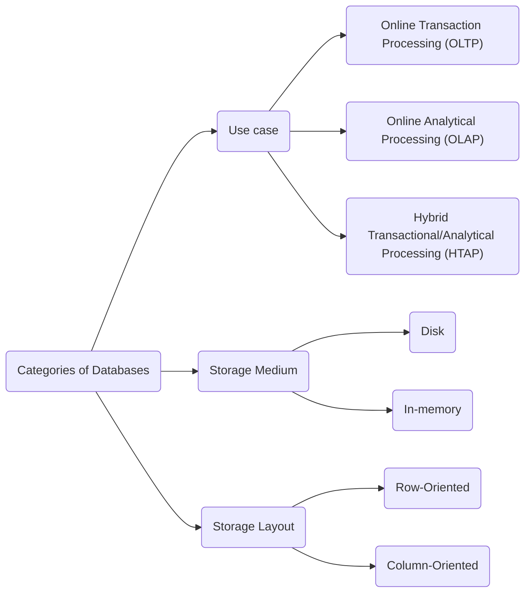

# Chapter 1: Introduction and Overview

Database system == client/server model == database nodes are the servers + applications that use the database are the clients.

## Database Architecture

Database architecture has the following components:
1. **Transport subsystem**

    i. Sending and receiving data between the client and the database.

    ii. Communication between the other nodes of the DB cluster.

2. **Query processor**

    i. Parse, validate, and optimize queries.

3. **Execution engine**

    i. Execute the query. This could be local or remote execution. (remote execution is when the query is executed on a different node)
    
4. **Storage engine**

    i. Helps the execution engine to read and write data from the storage.

    ii. Responsible for the storage layout and the storage medium.

## Lifecycle of a query

Client request -> Transport subsystem -> Query processor -> Execution Engine -> Storage engine -> Execution engine -> Transport subsystem -> Client response

## Storage Engine
Since part 1 of the book is about storage engines, we look at the storage engine in more detail.

It has several components:

1. **Transaction Manager**

    i. Responsible for scheduling transactions.

    ii. Makes sure queries do not cause inconsistencies in the database.
    
2. **Lock Manager**

    i. Responsible for concurrency control, thus preventing violation of data integrity.
    
3. **Access Methods (storage structures)**
    
    i. Facilitates access to data + organizing data on disk.

    ii. Examples could be B trees, LSM trees, etc

4. **Buffer Manager**
    
    i. Responsible for caching data pages in memory.

5. **Recovery Manager**
    
    i. Responsible for recovering the database state in the event of failures.

## Dividing databases into categories




## OLTP vs OLAP vs HTAP Databases

OLTP == optimized for transactional workloads. Often used in user-facing requests and transactions.

OLAP == optimized for analytical workloads. Often used for analytics and data warehousing.

HTAP == optimized for both transactional and analytical workloads.

> Why not use HTAP?  
HTAP is a compromise between OLTP and OLAP. It has both things but it's not the best at either of them. It is a compromise.

## Disk vs In-memory Databases

| Type of database | Use memory for | Use disk for |
|----------|----------|----------|
| In-memory | storing data | recovery and logging |
| Disk | caching + temporary storage | storing data |


Idea here is that accessing RAM is much faster than accessing disk, but RAM is volatile.

NVM storage (non-volatile memory) is a new technology that is being used to store data in memory. It is non-volatile, so it is not lost when the power is turned off.

### Durability in in-memory databases

Since in-memory databases are volatile, they need to be made durable. This is done by maintaining backups on disk. But how?

### Checkpointing

It has 2 components:
1. **Sequential log file:** Before any operation is called successful, the database must ensure that the data is written to a sequential log file. This is done by using a technique called *write-ahead logging*, which is a topic for a future chapter.
2. **Backup copy:** Another thing we store on disk is a *backup copy* of the database. The "checkpointer" is a component of recovery manager that is responsible for maintaining a backup copy of the database in an almost up-to-date state. (Source / Good read: https://pages.cs.wisc.edu/~vijayan/ra/papers/checkpointing-memory-resident-db.pdf)

**How do these 2 components work together?**

Log entries are applied to the backup copy in batches **asynchronously**. When the batch is applied, the log entries are removed from the log file, and the backup copy holds a database snapshot for a specific point in time. This process is called *checkpointing* and ensures that the database is durable.

**Why do we need to discard the log entries after they are applied to the backup copy?** 

Because the log file can grow very large, and we don't want that as that would slow down the recovery process.

**A small example for visualization**

NOTE: This is ONLY FOR VISUALIZATION. This does NOT reflect the actual implementation and intricacies of checkpointing.

Let's say current state of the database is 
```
id=1, name=akshat
id=2, name=mohit
```

Let's say current state of the log file has entries for id=1 and id=2.

```
t=20 October 2023, 10:00:00: `id=1, name=akshat`
t=20 October 2023, 10:00:01: `id=2, name=mohit`
```

Let's say the current state of backup copy has not been updated since the last checkpoint, and contains the following entries:

```
id=1, name=akshat
```


Let's say we crash the system before the checkpointer has had a chance to apply the log entries to the backup copy. The recovery manager has all the data needed to recover the database to the actual state by reading log entries + backup copy.

The log entries can be discarded after the backup copy is updated because the information is redundant. The backup copy already has the data, so we don't need the log entries anymore till now. This is done by the checkpointer.

TLDR: Checkpointing is essentially the following:
```python
expected_state_of_db = apply_log_entries_to_backup_copy(backup_copy, log_entries)
```

## Row vs Column Oriented Databases

Row oriented databases store data in row-manner on the disk.

Column oriented databases store data in column-manner on the disk.

Very basic example could look like the following.

**Row oriented database:**
```
id=1, name=akshat, age=20
id=2, name=mohit, age=21
```

**Column oriented database:**
```
id=1, 2
name=akshat, mohit
age=20, 21
```

Data in disk is stored block-wise.
> Block is a minimal unit of data that can be read from or written to disk.

Queries like `SELECT name FROM users` would be faster in column oriented databases because we don't have to read the entire row, we just have to read the name column. This is because the different values for the column are stored together in the disk, hence we have to read less number of blocks. (ofcourse not for just 2 teeny tiny records, but you get the idea!)

Queries like `SELECT * FROM users where id=1` would be faster in row oriented databases because we don't have to read the entire column, we just have to read the row. This is because the different values for the row are stored together in the disk, hence we have to read less number of blocks.

TLDR: Row oriented stores improve spatial locality for rows, column oriented stores improve spatial locality for columns.

> Column oriented databases are used for OLAP workloads because the use-cases involve aggregations and analytical computations on lesser columns. Row oriented databases are used for OLTP workloads because they are optimized for transactional queries.

### Another interesting difference

Reading multiple values for same column in one run has some other interesting aspects in column oriented databases:
1. This improves cache utilization.
2. This has a better compression ratio.
3. This improves vectorization.

## Wide column stores
Examples: BigTable, HBase

Data is represented as a multidimensional map. Columns are grouped into column families. Inside each column family, the data is stored row-wise.

I don't fully understand the practical use-cases of this. I wasn't able to get good intuition on this from the book, so I'll skip this for now.

## Data Files and Index Files

This was the most confusing part of the chapter for me. I'll try to explain it as best as I can. Please correct me if I'm wrong.

This is about how data is organized on disk. 2 types of files are used:
1. Data files: These contain the actual data.
2. Index files: These contain the metadata for records of data files, to help us find the data we want efficiently.

Files are partitioned into pages. 1 page == one or many disk "blocks".

### Data Files

Data files can be organized in 3 ways:
1. Heap files: Data is stored in an unordered manner, mostly in a write-order.
2. Hash files: Bucketed approach of storing data. Hash of the key is used to determine the bucket in which the data is stored.
3. Index organized tables (IOT): Data is stored in the index itself.


Depending on the type of data file, the index file can have different contents (called "data entries"):
1. Heap files: Index file contains the file offsets (row locators).
2. Hash files: Index file contains the bucket IDs.
3. Index organized tables (IOT): Index file contains the primary key.

### Index Files

An index is a data structure that helps us find the data we want efficiently.

Types of index: Index on data file (primary file) is called **primary index** (also called primary index if it is on a composite primary key). All other indexes are called **secondary**.

Clustered vs non-clustered index: If the data is stored in the same order as the index, it is called a clustered index. Otherwise, it is called an non-clustered index.

The above differences are explained quite confusingly in the book. I'll update this section if I find a better explanation. I'm hopeful that chapter 2 will clear things up, as it has a lot of examples around this area.

## Primary index as an indirection

2 ways of accessing data:
1. Reference it directly (through file offset)
  
    i. Benefit: Faster, since less number of disk seeks are required.
    ii. Drawback: Pointers need to be updated when data is moved around / updated.

2. Reference it indirectly (through primary key index)

    i. Benefit: Less cost of pointer updates.
    ii. Drawback: Slower, since more number of disk seeks are required for reading.


## Buffering, Immutability, and Ordering

Storage structures have 3 variables:
1. Buffering: Whether the data is buffered in memory before being written to disk.
2. Immutability: Whether the data is updated in-place (mutable) or it's append-only (immutable).
3. Ordering: Whether the data is stored in the key order or not.


## Pending Doubts

1. Is the "Lifecycle of a query" part above correct? (Especially in the 2nd half of the cycle where response is to be returned)

[Update] Answer: Yes, it is correct.

Drop me an email if you would like to answer any of the doubts, or discuss: [Let's talk!](mailto:me@akjn.dev?subject=[Chapter%201]%20Doubts)

## Things to Read

1. NVM storage - current state, timelines, benchmarks, etc
2. Vector instructions / Vectorization in column oriented databases
3. Wide column stores - use cases, practical examples, etc


## Reading group discussion

This section contains anything worth mentioning that came up as part of the weekly reading group discussion.


1. What is a possible migration plan from Database-A to Database-B ?

    i.  A very interesting story of a migration from Couchbase to Aerospike: [Large Scale NoSQL Database Migration Under Fire](https://medium.com/appsflyerengineering/large-scale-nosql-database-migration-under-fire-bf298c3c2e47)

    ii. [Online migrations at scale](https://stripe.com/blog/online-migrations)

2. If you wonder about the rationale behind design decision of DBs implementing their own data cache (buffer pools), and forgoing pagecache of OS and using direct I/O on underlying filesystem, here's a good paper by Andy Pavlo: https://db.cs.cmu.edu/papers/2022/cidr2022-p13-crotty.pdf

3. Request lifecycle

An interesting example was mentioned by someone on my doubt on request lifecycle.

Once you arrive at the execution engine, it's not so linear.

As an example, take `SELECT * FROM foo WHERE bar IN (SELECT bar FROM boop)`.

The execution engine will end up with a plan like:
```
1. Read table boop's bar field into List A.
2. Sort List A (to make step 4's search faster).
3. Read each row from table foo.
4. Emit each all the fields from foo into the result set if foo.bar in List A.
```

So we would have the execution engine reading from the storage engine in (1), doing some internal processing, then going back out to the storage engine to read table foo's rows in step (3). There's an interaction between the two of them as execution proceeds. As we increase complexity of queries, introduce indexes, etc etc etc, it's very easily going to get complicated. We might even have several storage engines involved in a single query (eg, indexes and primary data in different engines).

Step 4 might emit the rows directly to the client, or it might buffer them before returning. If there's a sort, group etc. involved it might _have_ to buffer the results.
